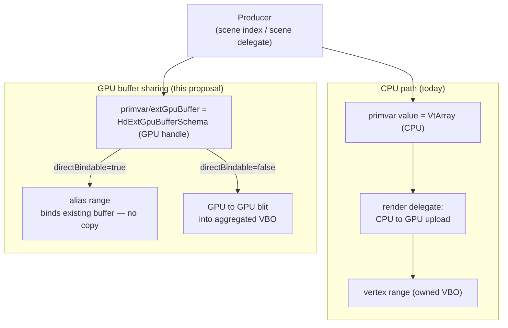

External GPU Buffer Sharing
===========================

Version 1 - August 5, 2026

## Contents

- [Background](#background)
- [What it is](#what-it-is)
- [How it works](#how-it-works)
- [Future Considerations](#future-considerations)

## Background

Hydra feeds geometry to a render delegate as CPU data: primvars are `VtArray`
values that flow through the scene index, and the render delegate uploads them
to the GPU when it builds its draw resources.

That model is a poor fit when the producer already holds the data on the GPU —
a GPU deformer, a GPU simulation, or any producer that shares a GPU context with
the renderer. To publish through the CPU primvar it must read the data back
(**GPU → CPU**), and the render delegate then uploads it again (**CPU → GPU**),
round-tripping data that never needed to leave the device. For animated
geometry this cost is paid every frame, and the readback tends to serialize the
GPU pipeline.

This proposal lets a producer hand Hydra a *handle* to a GPU buffer it already
owns, so the render delegate can bind or copy it on-device and skip the round
trip entirely.

## What it is

`HdExtGpuBufferSchema` is a typed container data source that a producer overlays
as a child of a primvar, under the token `extGpuBuffer`, describing an
**externally-owned GPU buffer** that backs that primvar. When it is present, it
becomes an alternative source of truth for the primvar's value: a render
delegate that understands it may consume the GPU buffer directly and never
require the CPU `VtArray`.

The schema describes the buffer, not how to bind it, so it stays **renderer- and
API-agnostic**:

| Member | Type | Meaning |
| --- | --- | --- |
| `backendApi` | `TfToken` | GPU API the handle belongs to (`GL`, `Vulkan`, `Metal`). A consumer ignores the buffer if it does not match the active backend. |
| `rawHandle` | `uint64` | The native GPU buffer handle (GL buffer id, `VkBuffer`, `MTLBuffer`, …). |
| `rawHandleByteSize` | `size_t` (optional) | Total byte size of the underlying allocation; enables a bounds check. |
| `numElements` | `size_t` | Number of elements (e.g. vertices) the primvar addresses. |
| `elementType` | `HdTupleType` | Element type and tuple arity (e.g. `Float32`×3 for points). |
| `byteOffset` | `size_t` (optional) | Offset to the first element within the buffer. |
| `byteStride` | `size_t` (optional) | Byte stride between consecutive elements (`0` = tightly packed). |
| `directBindable` | `bool` | Hint: `true` = the buffer may be bound directly (zero-copy); `false` = the consumer should copy it into its own storage. |

Because it is an ordinary data source living under an ordinary primvar, it flows
through scene indices unchanged and is discoverable with `GetFromParent`. It
carries no dependency on any particular producer, and a consumer that does not
understand it simply reads the CPU value as before.

## How it works

### Producer side

A producer publishes the schema as the `extGpuBuffer` child of a primvar
container, alongside the usual primvar descriptor. The CPU value may be left
empty when a valid GPU buffer is published. The producer keeps the buffer alive
and coherent while it is published, and dirties the primvar when the buffer's
identity or contents change.

### Consumer side

Storm is used here as the example consumer; another render delegate would follow
the same shape, and the concrete `HdSt*` types below are its reference
implementation rather than part of the schema contract.

The render delegate reads the schema at the emulation boundary
(`GetRenderIndex().GetTerminalSceneIndex()->GetPrim(id).dataSource`), decodes it
once into a renderer-private descriptor, and turns it into a buffer source that
carries **no CPU payload**. In Storm this is three pieces:

- `HdStExtGpuBufferDesc` — the decoded, flattened descriptor (`FromSchema`).
- `HdStExtGpuBuffer` — a **non-owning** `HgiBuffer` wrapper around `rawHandle`;
  its destructor does not free the resource.
- `HdStExtGpuBufferSource` — an `HdBufferSource` whose CPU `GetData()` is never
  called; consumers detect it (via `dynamic_cast`) and take a GPU path.

`HdStMesh::_PopulateVertexPrimvars` (and the face-varying / element equivalents)
try to build an `HdStExtGpuBufferSource` from the schema **before** falling back
to the CPU `HdVtBufferSource`. The `directBindable` hint then selects one of two
strategies:

**Direct bind (zero-copy) — `directBindable = true`.** The source goes into an
`HdStExtGpuBufferArrayRange`, a buffer array range that *aliases* the producer's
GPU buffer instead of owning storage; Storm binds the external handle directly.
A byte-only update (producer overwrites the same handle in place) is seen at the
next draw with no work; a change of handle or element count is applied as an
in-place range update that keeps the range pointer stable and avoids draw-batch
invalidation. This path is not aggregatable — each buffer is its own binding.

**Copy into aggregated storage — `directBindable = false`.** The source is
aggregated normally, and the aggregation strategy's `CopyData` detects the
external source and performs a **GPU → GPU blit** from the producer's buffer into
Storm's own vertex buffer, instead of a CPU upload. The geometry stays inside
Storm's indirect-draw batches, at the cost of one blit per dirty primvar per
frame for animating geometry.

### Validation and fallback

The GPU path is an optimization that always degrades safely to the CPU path:

- **Backend match** — if `backendApi` does not match the active backend, the
  consumer ignores the schema and reads the CPU value.
- **Completeness / bounds** — a schema missing required members, or whose
  `byteOffset + numElements * stride` exceeds `rawHandleByteSize`, is rejected.
- **No CPU coupling** — the schema is a child of the primvar, so a consumer that
  does not implement it falls through to the CPU value automatically.

### Dirtying

Updating shared geometry uses the ordinary primvar dirtying model: the producer
dirties the primvar's locator (e.g. `primvars/points`), which maps to
`HdChangeTracker::DirtyPoints`, and the render delegate re-reads. The cost now
depends on the mode:

- **Direct bind, stable handle** — re-reading rebinds the same handle in place,
  no copy. For a pure byte-only deformation the dirty is largely redundant: the
  alias already exposes the new bytes at the next draw, so it can be elided
  except where the delegate must recompute derived data (e.g. smooth normals)
  from the moved points.
- **Copy into aggregated storage** — `DirtyPoints` drives the GPU → GPU blit that
  refreshes the aggregated buffer, and is required each frame the data changes.

A static mesh can therefore aggregate and batch from the first frame, while an
animating mesh backed by a stable GPU handle can reach a near-zero per-frame
publish cost.

## Future Considerations

- **Synchronization and ownership handshake.** This proposal assumes the
  producer keeps the buffer valid and coherent for the consumer's reads. A
  robust design needs an explicit contract for buffer lifetime and for ordering
  in **both** directions: producer-writes-before-consumer-reads (so a draw never
  samples a half-written buffer) and consumer-reads-before-producer-overwrites
  (so the producer does not stomp a buffer a draw is still reading, when it
  updates in place rather than to a fresh allocation). Expressed with fences /
  timeline semaphores / events rather than relying on implicit same-context,
  same-queue coherence. This is intentionally out of scope here and is the most
  important follow-up.

- **Cross-API interop.** `rawHandle` currently assumes the producer and consumer
  share the same GPU API and context. First-class Vulkan/Metal support would
  build on external-memory and external-semaphore extensions so a buffer created
  by one API can be imported by another.
