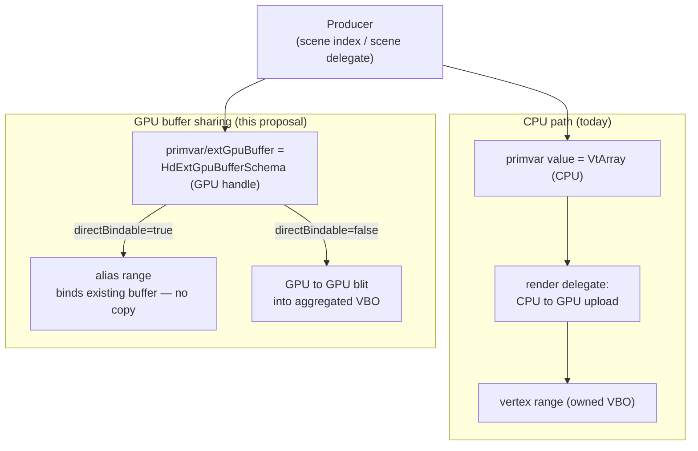

External GPU Buffer Sharing
===========================

Version 1 - August 5, 2026

## Contents

- [Background](#background)
- [What it is](#what-it-is)
- [How it works](#how-it-works)
- [Future Considerations](#future-considerations)

## Background

Hydra feeds geometry to a render delegate as CPU data: primvars are `VtArray`
values that flow through the scene index, and the render delegate uploads them
to the GPU when it builds its draw resources.

That model is a poor fit when the producer already holds the data on the GPU —
a GPU deformer, a GPU simulation, or any producer that shares a GPU context with
the renderer. To publish through the CPU primvar it must read the data back
(**GPU → CPU**), and the render delegate then uploads it again (**CPU → GPU**),
round-tripping data that never needed to leave the device. For animated
geometry this cost is paid every frame, and the readback tends to serialize the
GPU pipeline.

This proposal lets a producer hand Hydra a *handle* to a GPU buffer it already
owns, so the render delegate can bind or copy it on-device and skip the round
trip entirely.

## What it is

`HdExtGpuBufferSchema` is a typed container data source that a producer overlays
as a child of a primvar, under the token `extGpuBuffer`, describing an
**externally-owned GPU buffer** that backs that primvar. When it is present, it
becomes an alternative source of truth for the primvar's value: a render
delegate that understands it may consume the GPU buffer directly and never
require the CPU `VtArray`.

The schema describes the buffer, not how to bind it, so it stays **renderer- and
API-agnostic**:

| Member | Type | Meaning |
| --- | --- | --- |
| `backendApi` | `TfToken` | GPU API the handle belongs to — the same token Hgi reports via `Hgi::GetAPIName()` (`HgiTokens->OpenGL` / `Vulkan` / `Metal`). A consumer ignores the buffer if it does not match the active backend. |
| `rawHandle` | `uint64` | The native GPU buffer handle (GL buffer id, `VkBuffer`, `MTLBuffer`, …). |
| `rawHandleByteSize` | `size_t` (optional) | Total byte size of the underlying allocation; enables a bounds check. |
| `numElements` | `size_t` | Number of elements (e.g. vertices) the primvar addresses. |
| `elementType` | `HdTupleType` | Element type and tuple arity (e.g. `Float32`×3 for points). |
| `byteOffset` | `size_t` (optional) | Offset to the first element within the buffer. |
| `byteStride` | `size_t` (optional) | Byte stride between consecutive elements (`0` = tightly packed). |
| `directBindable` | `bool` | Hint: `true` = the buffer may be bound directly (zero-copy); `false` = the consumer should copy it into its own storage. |

Because it is an ordinary data source living under an ordinary primvar, it flows
through scene indices unchanged and is discoverable with `GetFromParent`. It
carries no dependency on any particular producer, and a consumer that does not
understand it simply reads the CPU value as before.

## How it works

### The CPU path (baseline)

The GPU path mirrors the existing CPU primvar path, so it helps to state that
baseline first.

A producer publishes a primvar as a container data source under
`primvars/<name>`, holding the value, its `interpolation`, and its `role`. The
value is a `HdSampledDataSource` whose `GetValue()` returns a `VtValue` wrapping
a `VtArray<T>` — e.g. `VtArray<GfVec3f>` for points — that owns N elements of
CPU data. This container flows through the scene indices unchanged and is read
by the render delegate at the emulation boundary.

The render delegate then turns that `VtArray` into its own draw resources. In
Storm the steps are:

- **Buffer source** — the array is wrapped in an `HdVtBufferSource`, an
  `HdBufferSource` that *holds the CPU bytes* and knows its element type and
  count. This is the type the external-GPU source (`HdStExtGpuBufferSource`)
  substitutes for.
- **Aggregation** — the source is registered with the resource registry, which
  places it in a **buffer array range (BAR)** — a sub-allocation inside a larger
  aggregated vertex buffer (VBO) shared with other prims of compatible layout,
  so many prims draw from few buffers.
- **Upload** — on commit, the registry copies the source's CPU bytes into that
  VBO region (**CPU → GPU**). On a `DirtyPoints`, the producer republishes the
  `VtArray`, and the delegate re-runs the upload to refresh the region.

So the CPU array is copied at least twice on the way to the GPU: once when the
producer materializes it (often itself a **GPU → CPU** readback if the data was
computed on-device), and again on the delegate's upload. The GPU buffer path
replaces the `HdVtBufferSource` with a source that carries a handle instead of
bytes, and either aliases that handle as its own BAR (direct bind) or blits it
GPU → GPU into the aggregated VBO — removing both copies.

### Producer side

A producer publishes the schema as the `extGpuBuffer` child of a primvar
container, alongside the usual primvar descriptor. The CPU value may be left
empty when a valid GPU buffer is published. The producer keeps the buffer alive
and coherent while it is published, and dirties the primvar when the buffer's
identity or contents change.

### Consumer side

Storm is used here as the example consumer; another render delegate would follow
the same shape, and the concrete `HdSt*` types below are its reference
implementation rather than part of the schema contract.

The render delegate reads the schema at the emulation boundary
(`GetRenderIndex().GetTerminalSceneIndex()->GetPrim(id).dataSource`), decodes it
once into a renderer-private descriptor, and turns it into a buffer source that
carries **no CPU payload**. In Storm this is three pieces:

- `HdStExtGpuBufferDesc` — the decoded, flattened descriptor (`FromSchema`).
- `HdStExtGpuBuffer` — a **non-owning** `HgiBuffer` wrapper around `rawHandle`;
  its destructor does not free the resource.
- `HdStExtGpuBufferSource` — an `HdBufferSource` whose CPU `GetData()` is never
  called; consumers detect it (via `dynamic_cast`) and take a GPU path.

`HdStMesh::_PopulateVertexPrimvars` (and the face-varying / element equivalents)
try to build an `HdStExtGpuBufferSource` from the schema **before** falling back
to the CPU `HdVtBufferSource`. The `directBindable` hint then selects one of two
strategies:

**Direct bind (zero-copy) — `directBindable = true`.** The source goes into an
`HdStExtGpuBufferArrayRange`, a buffer array range that *aliases* the producer's
GPU buffer instead of owning storage; Storm binds the external handle directly.
A byte-only update (producer overwrites the same handle in place) is seen at the
next draw with no work; a change of handle or element count is applied as an
in-place range update that keeps the range pointer stable and avoids draw-batch
invalidation. This path is not aggregatable — each buffer is its own binding.

**Copy into aggregated storage — `directBindable = false`.** The source is
aggregated normally, and the aggregation strategy's `CopyData` detects the
external source and performs a **GPU → GPU blit** from the producer's buffer into
Storm's own vertex buffer, instead of a CPU upload. The geometry stays inside
Storm's indirect-draw batches, at the cost of one blit per dirty primvar per
frame for animating geometry.

### Validation and fallback

The GPU path is an optimization that always degrades safely to the CPU path:

- **Backend match** — if `backendApi` does not match the active backend, the
  consumer ignores the schema and reads the CPU value.
- **Completeness / bounds** — a schema missing required members, or whose
  `byteOffset + numElements * stride` exceeds `rawHandleByteSize`, is rejected.
- **No CPU coupling** — the schema is a child of the primvar, so a consumer that
  does not implement it falls through to the CPU value automatically.

### Fallback and capability negotiation

The mechanism above is safe — a consumer that does not understand `extGpuBuffer`
simply reads the primvar value — but whether that fallback actually *renders*
depends on what the producer left in the value slot. A producer that publishes
GPU-only (empty `VtArray` + `extGpuBuffer`) avoids the readback the proposal
exists to remove, but a non-supporting consumer then reads an empty array and
the prim disappears. Publishing both a full CPU `VtArray` and the schema is
always fallback-correct, but pays the GPU → CPU readback every frame — defeating
the optimization. So the producer is otherwise forced to choose between "fast"
and "portable."

The robust way out is a **lazy CPU value**: the producer publishes the
`extGpuBuffer` child alongside a value data source whose `GetValue()`
materializes the CPU array *only if it is actually pulled*.

- A GPU-aware consumer reads the child and never pulls the value → no readback.
- A non-supporting consumer pulls the value → the readback runs on demand →
  correct fallback.

Because Hydra is pull-based, this needs no negotiation and scales to multiple
simultaneous consumers (e.g. two viewports, or Storm plus a path tracer):
whichever consumer needs CPU data triggers the readback; the others never do.
The cost is that the fallback readback then happens mid-frame on the consuming
thread, which is acceptable for a correctness path that only fires when needed.

Providing the GPU buffer plus a lazy CPU value is enough on its own, and is the
recommended approach. A separate renderer-capability query — e.g. a new
`HdRenderDelegate::IsExtGpuBufferSharingSupported()` — was considered as a way to
let the producer skip wiring up the lazy readback entirely, but it turns out to
add little:

- **Support is per-primvar, not per-renderer.** In practice a scene mixes CPU-
  and GPU-backed primvars within a single renderer, so a renderer-wide boolean
  cannot tell the producer what to do for any given prim. The lazy value already
  resolves this at the right granularity, one primvar at a time, with no query.
- **It would only avoid setting up the lazy path**, not change correctness —
  and the lazy path costs nothing until it is pulled. With multiple active
  consumers the flag would also have to be combined as an intersection (drop CPU
  only if *every* delegate supports sharing), adding negotiation logic for a
  marginal saving.

So the capability check stays out of the schema contract; publishing the GPU
buffer with a lazy CPU value is both sufficient and correct.

### Dirtying

Updating shared geometry uses the ordinary primvar dirtying model: the producer
dirties the primvar's locator (e.g. `primvars/points`), which maps to
`HdChangeTracker::DirtyPoints`, and the render delegate re-reads. The cost now
depends on the mode:

- **Direct bind, stable handle** — re-reading rebinds the same handle in place,
  no copy. For a pure byte-only deformation the dirty is largely redundant: the
  alias already exposes the new bytes at the next draw, so it can be elided
  except where the delegate must recompute derived data (e.g. smooth normals)
  from the moved points.
- **Copy into aggregated storage** — `DirtyPoints` drives the GPU → GPU blit that
  refreshes the aggregated buffer, and is required each frame the data changes.

A static mesh can therefore aggregate and batch from the first frame, while an
animating mesh backed by a stable GPU handle can reach a near-zero per-frame
publish cost.

### Instancing

Instancing meets buffer sharing on two independent axes, matching Hydra's split
between a prototype rprim and its instancer.

**Prototype primvars.** A prototype's geometry (points/normals/uv) is stored
once and drawn N times by an instanced draw — instances inherently refer to that
single buffer. So an external GPU buffer on a prototype primvar needs no
instancing-specific handling: it is the same prototype vertex buffer, bound once
and drawn N times, whether direct-bound or copied. A zero-copy alias range is
compatible with instanced draws because the draw reads each item's base offset
and element count independently of the instance count. (The only nuance is batch
aggregation — a direct-bound prototype forms its own draw batch instead of
aggregating with normally-uploaded prototypes; a cost/parallelism trade-off, not
a correctness issue.) `numElements` here is the prototype's vertex count, exactly
as in the non-instanced case.

**Instancer primvars.** The per-instance data an instancer carries (instance
transforms, or translate/rotate/scale) is a *separate* buffer published on the
**instancer** prim, not the prototype. When a producer computes this on the GPU
(a GPU/particle instancer), it can publish `extGpuBuffer` on the instance primvar
exactly as for geometry, with `numElements` equal to the **instance count**. The
consumer builds the source in its instance-primvar population step and
direct-binds or copies it as usual. This is often the higher-value share: for
large, animating instance counts the transform buffer dominates, and sharing it
avoids reading back and re-uploading one transform per instance every frame,
whereas the prototype geometry is bound once regardless.

A single GPU buffer can even back several per-instance streams at once: each
primvar publishes its own schema pointing at the same `rawHandle`, with
`byteOffset`/`byteStride` selecting its region. So both layouts work:

- **AoS** (each instance = `{mat4 xform, vec4 color, …}`): xform → offset 0,
  stride = struct size; color → offset 64, stride = struct size.
- **SoA** (all transforms, then all colors): xform → offset 0, stride 64;
  color → offset = transforms-region size, stride 16.

Nested instancing needs no special handling — each nesting level is its own
instancer with its own instance-primvar buffer, so the same per-instancer
consumption applies at every level.

Two considerations are specific to instancer primvars: `numElements` must be the
instance count (the consumer uses it to bound instance indices), and a shared
instance-transform buffer must already be in the renderer's expected matrix
layout/precision, since the GPU path skips the CPU matrix conversion the value
path would otherwise perform (sharing plain translate/rotate/scale vectors avoids
that).

### Alternatives considered

**Carry the GPU buffer in the primvar value itself.** Rather than add a schema,
the GPU handle could ride in the same value slot that holds CPU data — either as
a custom struct wrapped in a `VtValue`, or stuffed into a `VtArray`. It is
tempting because the primvar value plumbing already exists, but it was rejected:

- **It is not an array.** A GPU buffer is one opaque descriptor of eight
  heterogeneous fields (handle, backend, offset, stride, type, count, …), not N
  elements of vertex data. A `VtArray` holds a single typed array, so it can
  carry at most the handle; the remaining fields would need sibling data sources
  anyway — a hand-rolled schema without the type safety. Wrapping the descriptor
  as a struct in a `VtValue` is the other option, but that is exactly the older
  POD-in-`VtValue` design this schema replaced.
- **It breaks un-updated consumers.** Every reader of a primvar does
  `value.Get<VtArray<GfVec3f>>()` / `IsHolding<…>()` — extent and bounds
  computation, CPU fallback, refinement, picking, other render delegates. If the
  value slot holds a GPU descriptor instead of points, those either read empty or
  misinterpret it. Keeping the GPU info in a *separate child* leaves the value
  slot legitimately empty, so a consumer that does not understand the child falls
  through to the CPU value automatically.
- **Value semantics fight GPU ownership.** `VtArray` is copy-on-write and freely
  copied, detached, and mutated; the shared handle is non-owning and must not be.
  A container built for value-semantic CPU arrays is the wrong home for it.

The child-schema overlay avoids all three: it is discoverable and introspectable,
gives typed accessors plus an `IsComplete()` check, composes onto the existing
primvar without disturbing its value, and follows the same idiom as
`HdPrimvarSchema` and `HdExtComputationSchema`.

## Future Considerations

- **Synchronization and ownership handshake.** This proposal assumes the
  producer keeps the buffer valid and coherent for the consumer's reads. A
  robust design needs an explicit contract for buffer lifetime and for ordering
  in **both** directions: producer-writes-before-consumer-reads (so a draw never
  samples a half-written buffer) and consumer-reads-before-producer-overwrites
  (so the producer does not stomp a buffer a draw is still reading, when it
  updates in place rather than to a fresh allocation). Expressed with fences /
  timeline semaphores / events rather than relying on implicit same-context,
  same-queue coherence. This is intentionally out of scope here and is the most
  important follow-up.

- **Cross-API interop.** `rawHandle` currently assumes the producer and consumer
  share the same GPU API and context. First-class Vulkan/Metal support would
  build on external-memory and external-semaphore extensions so a buffer created
  by one API can be imported by another.
